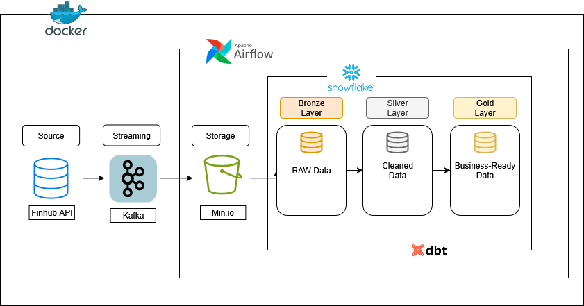

# 📊 Real-Time Stock Tracking Pipeline

This project demonstrates an **end-to-end data engineering pipeline** for real-time stock tracking, especially **blockchain and finance related corporations (Coinbase Global Inc., Marathon Digital Holdings Inc., MicroStrategy Inc. and BlackRock Inc.)**.

The pipeline leverages modern data tools to simulate how **streaming data can be ingested, orchestrated, transformed, and stored** for analytics and downstream use cases.

---

## 🚀 Architecture



```
Finhub API (Data Source) → Kafka → MinIO → Airflow DAG → Snowflake (Bronze) → dbt (Silver/Gold Models)
```

All core components (Kafka, MinIO, Airflow, and dbt) were deployed and orchestrated using **Docker containerization**, ensuring reproducibility, isolated environments, and easy scalability.

- **Kafka** → Streams ticker data from external APIs
- **MinIO** → S3-compatible object store for raw JSON files
- **Airflow** → Orchestrates ingestion & loading into Snowflake
- **Snowflake** → Cloud data warehouse for staging and querying
- **dbt** → Transformation into structured models (Silver/Gold layers)

---

## 🛠️ Tech Stack

<p align="left">


</p>

- **Data Streaming**: Apache Kafka
- **Storage**: MinIO (S3 API)
- **Orchestration**: Apache Airflow
- **Data Warehouse**: Snowflake
- **Transformation**: dbt

---

## 📂 Project Structure

```
├── dags/               # Airflow DAGs for ingestion
├── dbt/                # dbt models for transformations
├── infra/              # Infrastructure config (Docker, MinIO, Airflow)
├── venv/               # Local Python virtual environment (for testing/debugging)
└── requirements.txt    # Requirements for project
```

---

## ⚙️ Workflow

1. **Kafka** streams stock ticker data in near real-time
2. **MinIO** stores raw JSON snapshots in a Bronze bucket
3. **Airflow DAG** downloads files from MinIO and executes Snowflake `PUT` + `COPY INTO`
4. **Snowflake** holds the Bronze raw table
5. **dbt models** parse JSON into structured Silver/Gold tables for business-ready analysis

---

## 📌 Key Features

- Automated ingestion pipeline with **Airflow scheduling**
- Cloud-native storage & compute using **MinIO + Snowflake**
- SQL-first transformations with **dbt**
- Modular **Bronze–Silver–Gold data model architecture**

---

## ⚠️ Known Limitations

- Short observation window → limited volatility, many flat charts
- Snowflake `COPY_HISTORY` queries sometimes return partial logs
- Data refresh not fully automated beyond Airflow

---

## 🔮 Future Enhancements

- **Direct Kafka → Snowflake connector** (removes MinIO dependency)
- **Longer historical collection** for richer trend and volatility analysis
- **Monitoring/alerting** for Airflow DAG failures
- **Extend sources**: crypto APIs, traditional finance APIs

---

## 🎯 This Project Showcases

- **Data Engineering skills**: streaming ingestion, orchestration, cloud warehouses, transformations
- **Consulting mindset**: problem framing, modular design, scalability in mind
- **Real-world alignment**: pipeline pattern matches how modern data teams handle real-time financial data

---

## 📖 Getting Started

1. Clone the repository
2. Ensure Docker and Docker Compose are installed
3. Run `docker-compose up -d` to start all services
4. Access Airflow UI at `http://localhost:8080`
5. Trigger the DAG to start the pipeline

---

## 📧 Contact
namyun.kim@ue-germany.de
